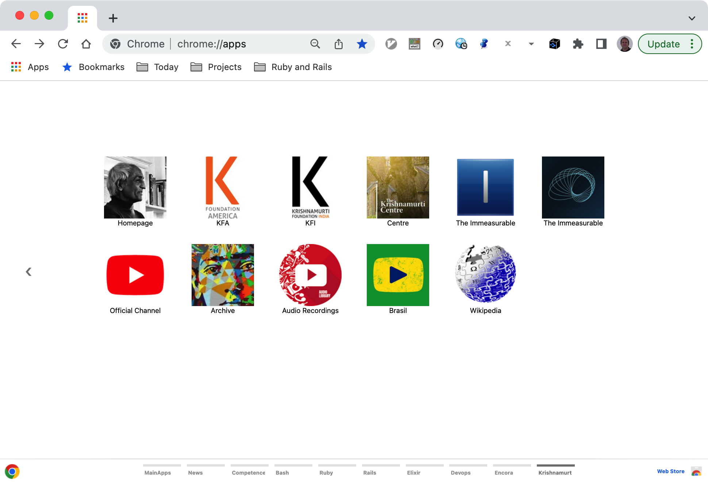

# Chrome Apps for Krishnamurti

Gather Jiddu Krishnamurti important references and shortcuts in form of Chrome Apps.


## Installation

### 1. Clone this repository and see its contents.

Open a terminal give the following command:

```bash
$ git clone https://github.com/enogrob/chromeapps-krishnamurti.git
```

As we can see a subdirectory is created for each Krishnamurti app:

$ ls -la

$ tree -L 1 apps/

### 2. Open Chrome with the following url:

In order to load the `Chrome Apps` for Krishnamurti, check `Developer Mode` and press `Load unpacked extension...` to load each App selecting its corresponding directory inside `apps` e.g. `Krishnamurti-Homepage`, and then repeat that for the wanted apps. Or just drag and drop the app folder on the [Extensions page](chrome://extensions).

[chrome://extensions](chrome://extensions)

### 3. After load the Chrome Apps wanted for Krishnamurti, Chrome will look like the screenshot below:


